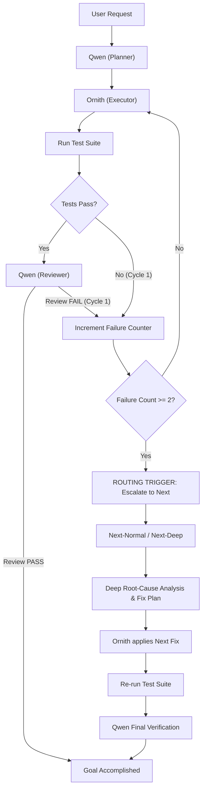

# Autonomous Multi-Model Routing & Escalation Policy

## 1. Role Definitions

### `Qwen3.8-27B-Opus` (`openai/qwen`)
- **Default Planner & Architect**: Decomposes user goals, prepares architecture specs, task definitions, acceptance criteria.
- **Normal Reviewer**: Reviews code submissions, runs lint/static checks, verifies standard unit test results.
- **Router**: Analyzes task complexity and directs execution flow.

### `Ornith-1.5-35B` (`openai/ornith`)
- **Coding Executor**: Implements code, writes unit and integration tests.
- **Terminal & Tools Operator**: Runs CLI commands, file operations, bash scripts.
- **Vision Agent**: Inspects UI screenshots, browser renderings, and visual outputs.

### `Qwen3-Next-80B-A3B-Thinking` (`openai/next`)
- **Heavy / Deep Reviewer**: Activated ONLY when standard review loops fail or deep multi-step algorithmic reasoning is required.
- **Diagnostic Engine**: Uncovers hidden race conditions, deadlocks, subtle concurrency bugs, and architectural edge cases.

---

## 2. Autonomous Escalation Criteria

### Escalation Triggers:
1. **Cycle Threshold**: `failure_count >= 2` in the execution-review loop.
2. **Concurrency / Threading Complexity**:
   - Multi-threaded deadlocks, race conditions, memory visibility bugs.
   - Distributed locking, atomicity violations.
3. **Deep Algorithmic Deadlock**:
   - Complex graph algorithms, high-dimensional DP, state-space exploration.
4. **Explicit User Directive**:
   - Direct request for deep reasoning, mathematical proof, or complex architecture analysis.

---

## 3. Escalation Tiers & Profiles

| Tier | Profile | Thinking Budget | Max Output | Use Case |
| :--- | :--- | :--- | :--- | :--- |
| **Tier 1 (Standard)** | `Qwen38_Opus_96K` / `Ornith-Coding` | Off / Native | 4096 | 90% of regular coding, refactoring, and terminal tasks. |
| **Tier 2 (Escalation Normal)** | `Next-Normal` | `thinking_budget_tokens: 2048` | 5120 | First escalation: subtle logic flaws, race conditions, edge-case failures. |
| **Tier 3 (Escalation Deep)** | `Next-Deep` | `thinking_budget_tokens: 4096` | 8192 | Second escalation: systemic bugs, protocol design, mathematical correctness proofs. |

> [!NOTE]
> **Zero-Reload Switching**:
> Switching between `Next-Normal` and `Next-Deep` operates in-place without triggering a process restart or model reload in `llama-swap`. Both profiles use `openai/next` on port 8080 with variable `thinking_budget_tokens` passed dynamically per request.

---

## 4. De-Escalation and State Preservation
- Once `Next` identifies the root cause and provides the fix:
  1. The complete reasoning output and code patch are handed back to `Ornith`.
  2. `Ornith` executes the code write and runs pytest / test suite.
  3. `Qwen` performs the final verification against original requirements.
  4. Conversation state, history, and workspace context are preserved across all model switches.
